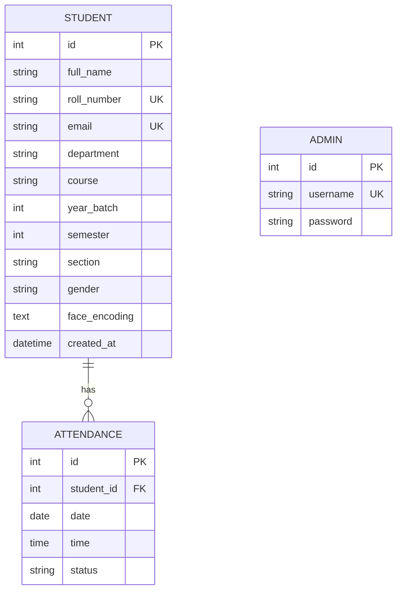

# Phase 2 — Database Design & Setup

## 🎯 Phase Goal
Design and implement a production-grade relational database schema for the AI Attendance System. This phase focuses on **data structure, integrity, and relationships**.

---

## 🏗️ Database Architecture Strategy

### 1. Normalization & Integrity
- **3rd Normal Form (3NF)**: We minimize data redundancy. Reference fields (Department, Semester) are structured to ensure consistency.
- **Strict Typing**: Using SQLAlchemy `Enum` and `String` constraints to prevent "garbage" data.
- **Foreign Keys**: Enforcing hard links between Students and Attendance records.

### 2. Scalability Planning
- **Indexing Strategy**: We will index `roll_number` (lookup), `date` (filtering), and `status` (analytics).
- **Face Encoding Storage**: Dedicated `TEXT` column to store high-dimensional facial vectors.
- **Admin Security**: Prepared for hashed password storage (authentication logic comes in Phase 3).

---

## 📊 Table Relationship Design

---

## 📝 Step Index

| Step | File | Description |
|------|------|-------------|
| 01 | `Step_01_Model_Definitions.md` | Creating SQLAlchemy models for Students, Attendance, and Admins. |
| 02 | `Step_02_Relationship_Mapping.md` | Setting up Foreign Keys and Back-references. |
| 03 | `Step_03_Database_Initialization.md` | Creating the `init_db` script and startup validation. |
| 04 | `Step_04_Utility_Enhancements.md` | Adding transaction and query logging utilities. |
| 05 | `Step_05_Schema_Testing.md` | Validating table creation and integrity constraints. |

---

## 🔮 Future Scalability
- **Partitioning**: The Attendance table is indexed by date to allow for future table partitioning if data exceeds millions of rows.
- **Async Prep**: Models are defined using standard SQLAlchemy, allowing for a seamless transition to `SQLAlchemy-Async` if needed.
- **Audit Logs**: The `created_at` fields allow for time-series analysis of student registrations.

---

## ⛔ Out of Scope (Phase 2)
- ❌ Authentication Logic (JWT/Hashing)
- ❌ Attendance Marking APIs
- ❌ Excel/PDF Export Logic
- ❌ AI Face Recognition Logic
