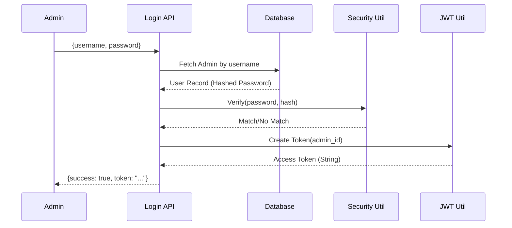

# Phase 3 — Authentication System

## 🎯 Phase Goal
Implement a secure, professional-grade authentication system using **JWT (JSON Web Tokens)** and **Bcrypt** hashing.

---

## 🛡️ Authentication Architecture Strategy

### 1. Password Security (Bcrypt)
- **Hashing**: Every password will be salted and hashed before storage.
- **Verification**: On login, we hash the provided password and compare it to the stored hash.

### 2. JWT Workflow
- **Issue**: Upon successful login, the server issues a signed JWT.
- **Payload**: The token contains the `admin_id` and an `expiry` timestamp.
- **Verification**: Future requests send this token in the `Authorization` header.

### 3. Route Protection
- **Dependencies**: We use FastAPI `Depends` to inject authentication into routes.
- **Unauthorized Handling**: If the token is missing, expired, or invalid, the system returns a `401 Unauthorized` response using our centralized error handler.

---

## 📊 Auth Flow Diagram

---

## 📝 Step Index

| Step | File | Description |
|------|------|-------------|
| 01 | `Step_01_Security_Utilities.md` | Password hashing and JWT generation helpers. |
| 02 | `Step_02_Authentication_Schemas.md` | Pydantic models for requests and responses. |
| 03 | `Step_03_Auth_Service_Layer.md` | Business logic for credential validation. |
| 04 | `Step_04_Login_API_Implementation.md` | Admin Login and Logout endpoints. |
| 05 | `Step_05_Route_Protection.md` | Implementing the Auth Dependency for protected routes. |
| 06 | `Step_06_Security_Testing.md` | Testing login success, failure, and route security. |

---

## 🔮 Future Scalability
- **Refresh Tokens**: The current design is ready for "Refresh Token" implementation to keep admins logged in longer without security risks.
- **RBAC**: Role-Based Access Control can be added by simply adding a `role` field to the JWT payload.

---

## ⛔ Out of Scope (Phase 3)
- ❌ Password Reset via Email
- ❌ Multi-Factor Authentication (MFA)
- ❌ Account Lockout Policies
- ❌ Dashboard Logic
