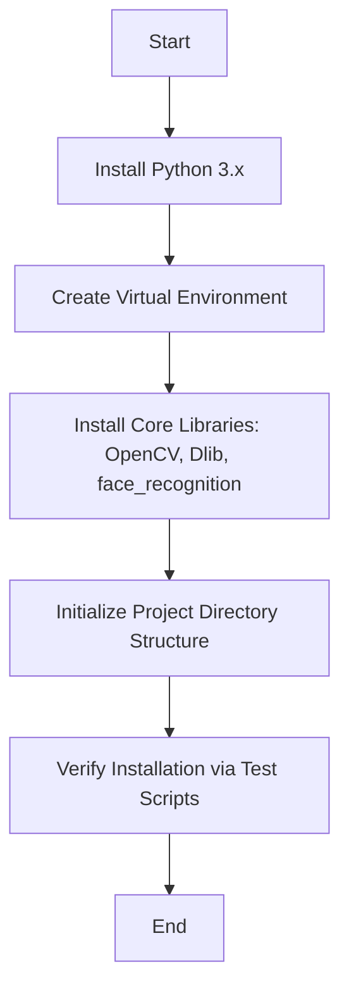

# Phase 1: Environment & Setup Workflow

## Description
This phase involves setting up the development environment, installing necessary AI/ML libraries, and establishing the project's modular architecture.

## Sequential Pipeline Architecture
```text
Requirement Analysis (Libraries, Hardware)
 |
 ↓
Virtual Environment Creation (Python venv)
 |
 ↓
Dependency Installation (OpenCV, Dlib, face_recognition)
 |
 ↓
Directory Scaffolding (ai_module, backend, frontend)
 |
 ↓
Configuration Setup (config.py, .env)
 |
 ↓
Setup Validation (Verify via test_scripts.py)
 |
 ↓
Setup Complete
```

## Visual Flow (Technical)

