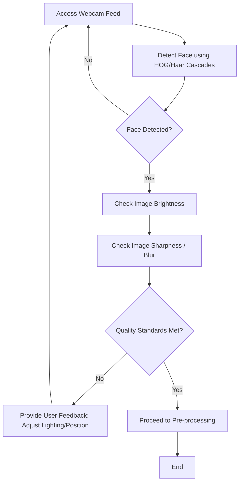

# Phase 2: Face Detection & Quality Validation Workflow

## Description
Focuses on capturing the webcam feed and ensuring that detected faces meet specific quality standards before registration.

## Sequential Pipeline Architecture
```text
Webcam Initialization (OpenCV VideoCapture)
 |
 ↓
Frame Acquisition (Continuous stream loop)
 |
 ↓
Face Detection (HOG / Haar Cascades)
 |
 ↓
Image Pre-processing (Grayscale, Normalization)
 |
 ↓
Quality Validation (Blur, Size, Lighting checks)
 |
 ↓
User Feedback (Real-time UI/Console alerts)
 |
 ↓
Quality Check Passed
```

## Visual Flow (Technical)

