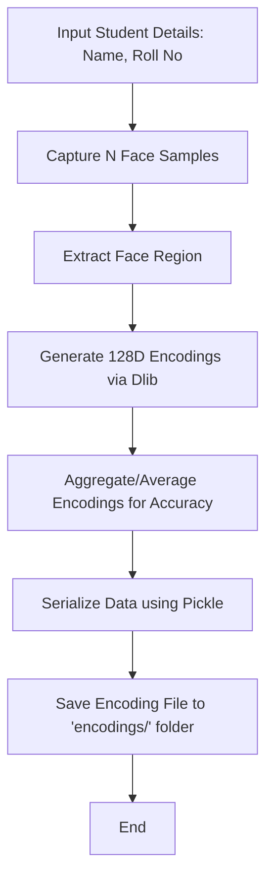

# Phase 3: Student Registration & Encoding Workflow

## Description
This phase handles the enrollment of new students by capturing multiple face samples and converting them into biometric signatures.

## Sequential Pipeline Architecture
```text
Terminal Input (Student ID, Name)
 |
 ↓
Webcam Stream Starts
 |
 ↓
Face Detection (reuse Phase 2 FaceDetector)
 |
 ↓
Quality Validation (blur, size, lighting)
 |
 ↓
Sample Capture (20 frames, timed intervals)
 |
 ↓
Image Storage (dataset/{student_id}/)
 |
 ↓
Encoding Generation (from saved images)
 |
 ↓
Encoding Storage (encodings/{student_id}.pkl)
 |
 ↓
Registration Complete
```

## Visual Flow (Technical)

