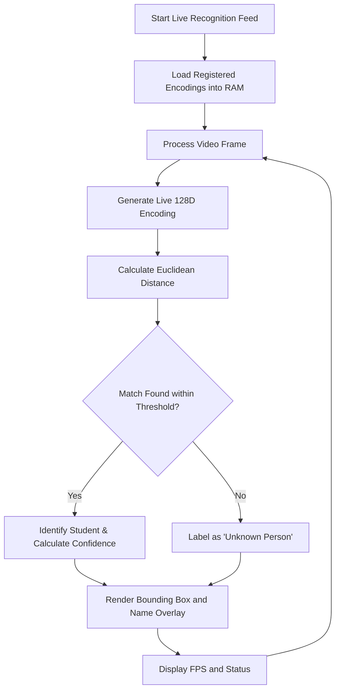

# Phase 4: Real-Time Recognition Workflow

## Description
The core engine that identifies students from the live video feed by comparing their real-time encodings.

## Sequential Pipeline Architecture
```text
System Initialization (Load FaceDetector)
 |
 ↓
Encoding Retrieval (Load .pkl from encodings/)
 |
 ↓
Real-time Stream Start
 |
 ↓
Face Detection in Live Feed
 |
 ↓
Live 128D Encoding Generation
 |
 ↓
Distance Comparison (Euclidean Distance)
 |
 ↓
Match Verification (Confidence Thresholding)
 |
 ↓
Identification Overlay (Bounding Boxes, Name)
 |
 ↓
Attendance Trigger (Signal to Backend)
```

## Visual Flow (Technical)

