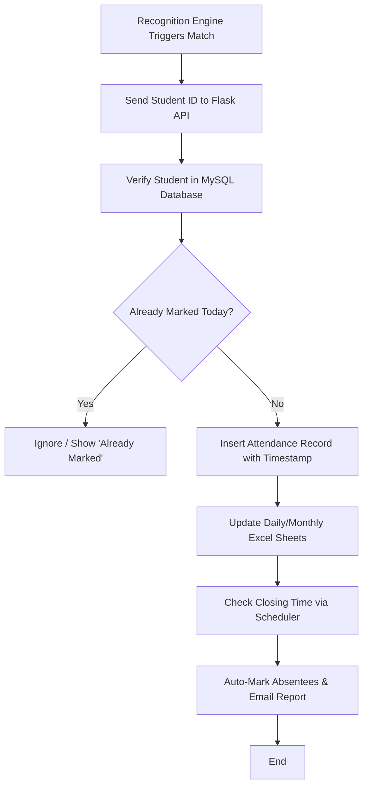

# Phase 5: Backend & Database Integration Workflow

## Description
Bridges the AI recognition engine with a persistent storage system to log attendance records.

## Sequential Pipeline Architecture
```text
API Endpoint Activation (Flask/FastAPI)
 |
 ↓
Request Reception (Student ID, Timestamp)
 |
 ↓
Database Lookup (MySQL Student Table)
 |
 ↓
Duplicate Check (Check if already marked today)
 |
 ↓
Attendance Logging (SQL INSERT Operation)
 |
 ↓
Excel Data Injection (update .xlsx via OpenPyXL)
 |
 ↓
Daily Summary Generation
 |
 ↓
Automated Email Dispatch (SMTP / Scheduler)
```

## Visual Flow (Technical)

