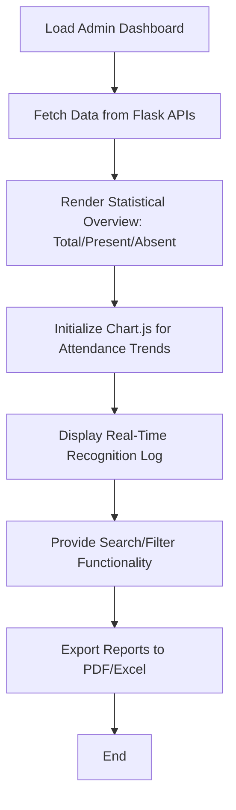

# Phase 6: Frontend Dashboard & Analytics Workflow

## Description
The final user interface where administrators can monitor and manage attendance data.

## Sequential Pipeline Architecture
```text
User Authentication (Secure Admin Login)
 |
 ↓
Dashboard Loading (Initialize React State)
 |
 ↓
API Data Fetching (Fetch Attendance Logs)
 |
 ↓
Real-time Feed Integration (Websocket/Stream)
 |
 ↓
Chart Rendering (Chart.js Visualization)
 |
 ↓
Search & Filter Logic (Date, Dept, Roll No)
 |
 ↓
Report Export Generation (CSV / PDF)
 |
 ↓
Dashboard Update Complete
```

## Visual Flow (Technical)

