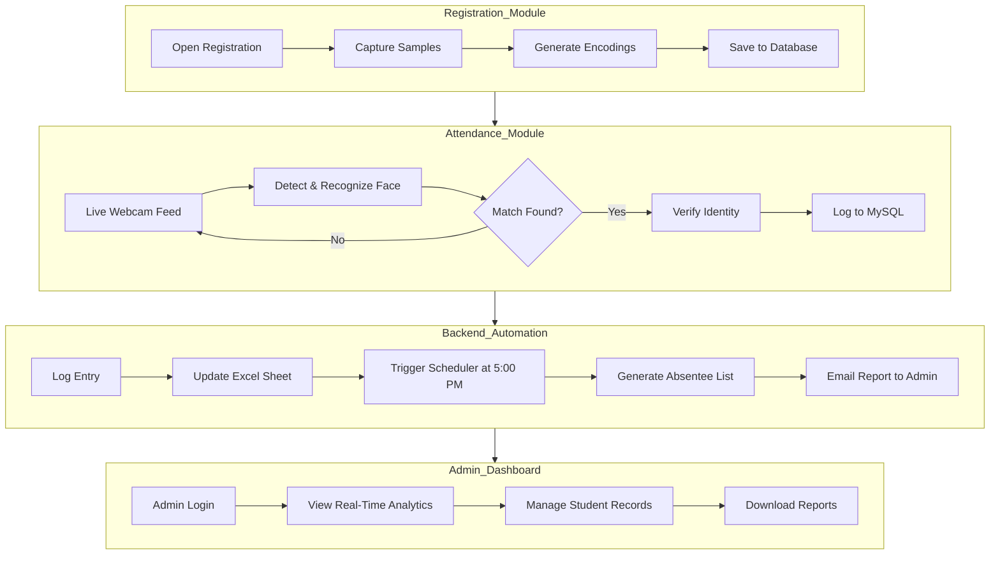

# Overall System Master Workflow

## Description
This master flowchart illustrates the end-to-end journey from a student's first registration to the final automated attendance report.

## Master Workflow

## Workflow Summary
1.  **Registration**: One-time biometric data collection.
2.  **Recognition**: Daily automated identity verification.
3.  **Automation**: Background processing and report delivery.
4.  **Analytics**: Visual monitoring and data management.
